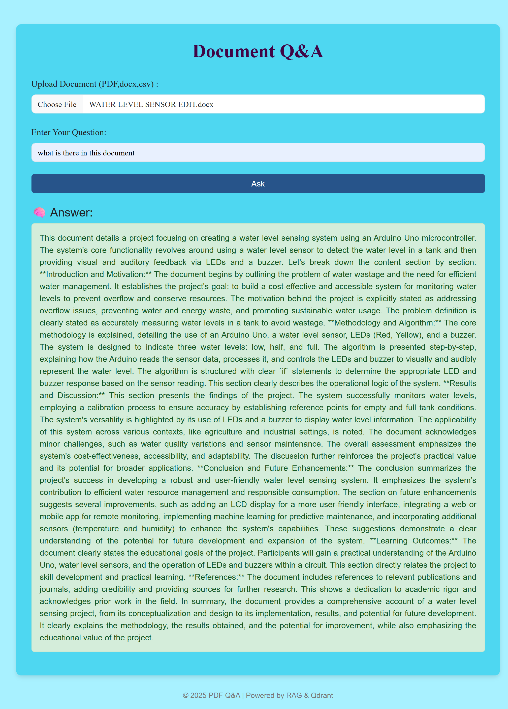

# 📄 PDF Q&A System with RAG using Qdrant & Gemini

This project is a **PDF Question Answering Web App** powered by **Qdrant vector search** and **Gemini 1.5 LLM**. Users can upload documents, ask natural language questions, and receive precise answers sourced directly from the document content using **Retrieval-Augmented Generation (RAG)**.

---

## 🚀 Features

- 🧠 Semantic search with Qdrant vector database
- 🤖 Context-aware answer generation using Gemini 1.5
- 📂 Supports `.pdf` documents
- 🗣️ Gracefully handles unanswerable questions
- 📱 Mobile-responsive UI built with Bootstrap

---

## 🛠️ Tech Stack

- **Frontend**: HTML, CSS, Bootstrap 5
- **Backend**: Python (Flask)
- **Vector DB**: Qdrant Cloud / Self-hosted
- **Embedding Model**: Gemini 1.5 Embeddings
- **LLM**: Gemini 1.5 Flash
- **Document Parsing**: `PyPDF2`

---

## 📸 How It Works

1. Upload a `.pdf` file.
2. Enter a question in natural language.
3. The system:
   - Extracts and chunks the text
   - Embeds it with Gemini 1.5
   - Stores it in Qdrant
   - Embeds the user query
   - Searches top-matching chunks
   - Generates a response using Gemini 1.5 Flash
4. Displays the result or a fallback message if no answer is found.

---

